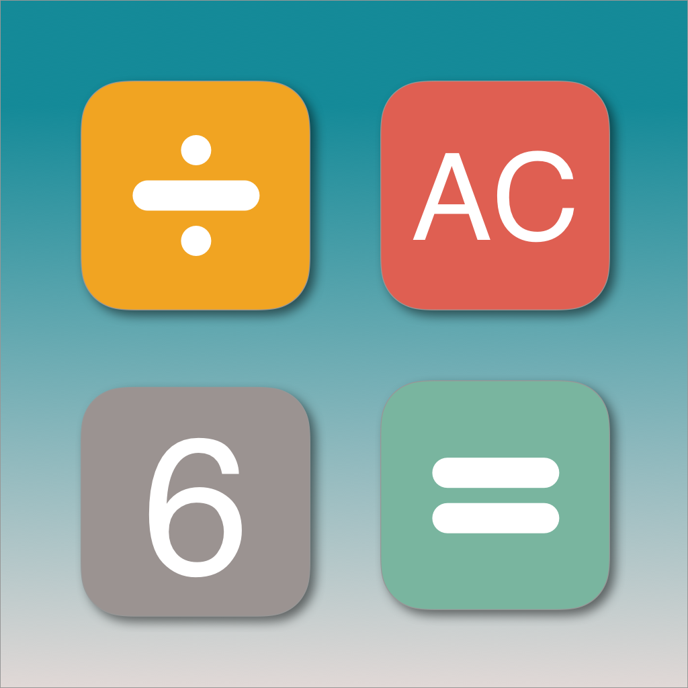
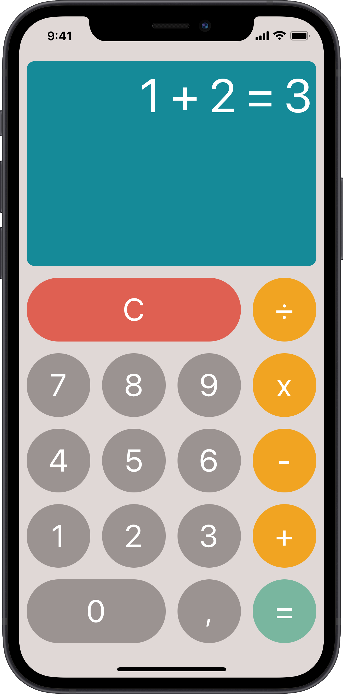
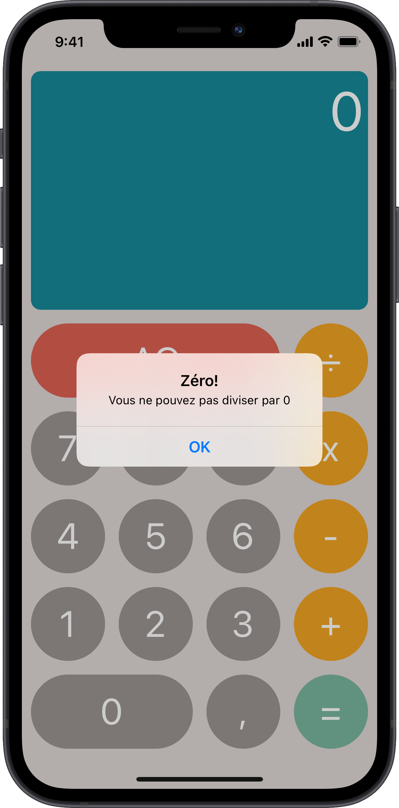
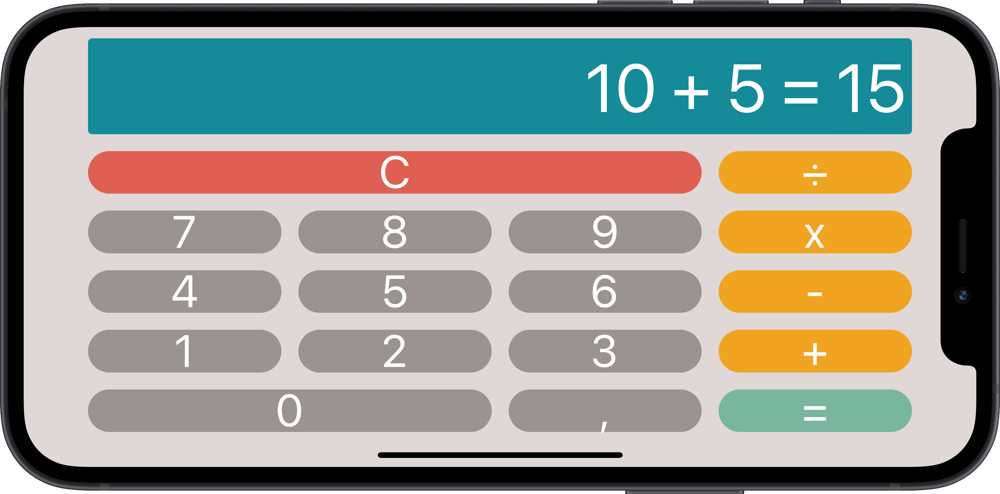

# Count On Me

    
    

    CountOnMe is the third coded protect of my training at OpenClassRooms. 
    If you wanna see the others, checkout my <a href="https://github.com/imick666/OpenClassRooms"> dedicated repo</a>
    

## Sommary
- [Introduction](#introduction)
- [Description](#description)
- [What I Learned](#what-i-learned)
- [Screenshots](#screenshots)

## Introduction

This project simulated a project handover. I had to :

- Refactor code to respect the MVC pattern.
- Finish the design and make it responsive.
- Finish the logic. Only the addition and the substraction worked.
- Write unit test for all the logic.

## Description

Count On Me is a calcutor. (Thank's captain obvious ^^)

## What I learned

- Work on existing project
- Write unit test
- Use NotificationCenter
- Use alerts
- Bonus:
    - In writting this reamde, I decided to automate screenshots. So I learn "Fastlane / snapshot" for the occasion ^^

## Screenshots

    
    
    
    

